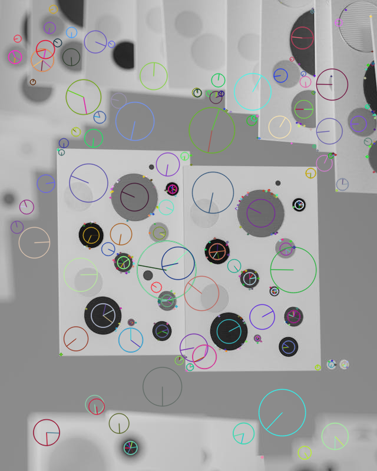
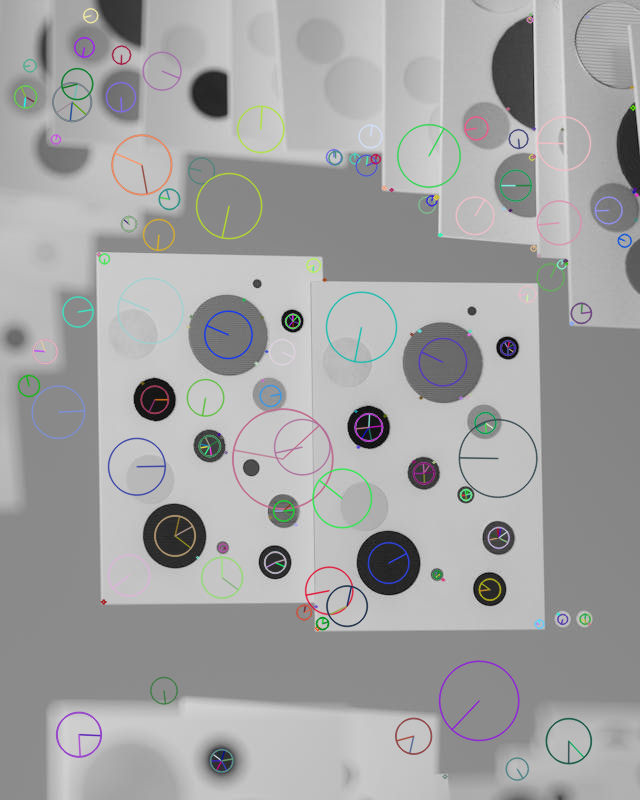
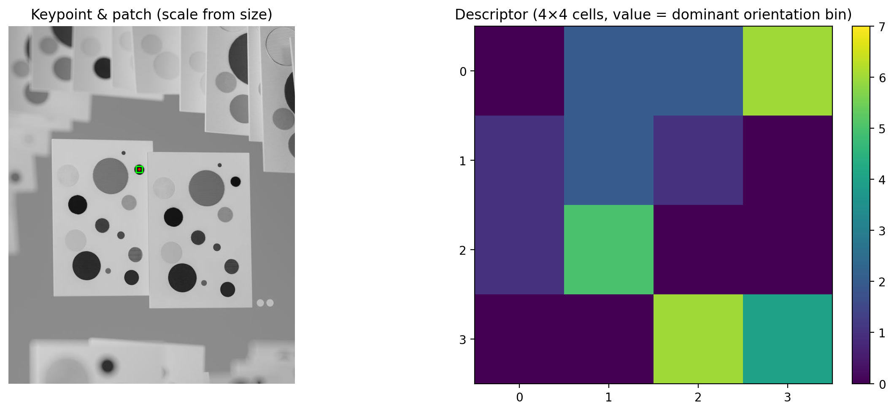
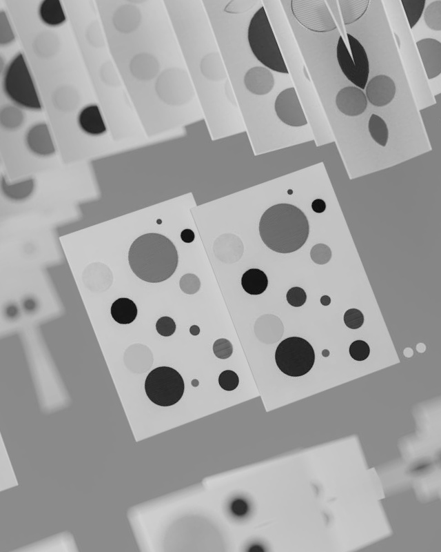
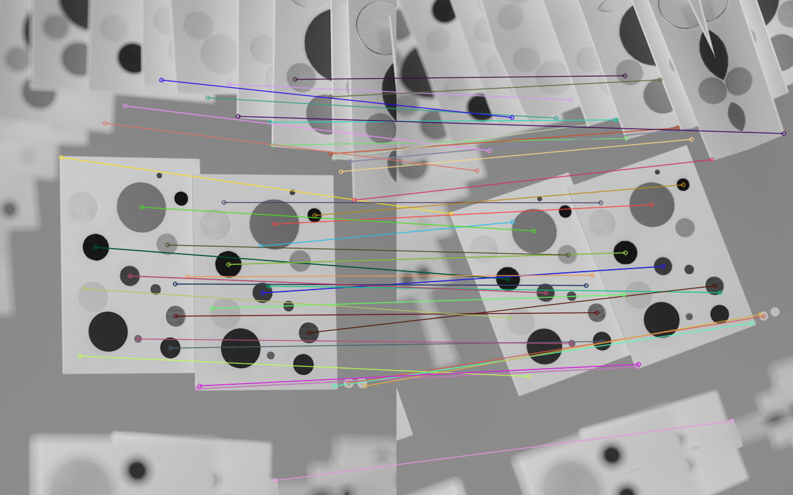

# Feature Detection Assignment

This repository shows blob detection and feature tuning using the SIFT (Scale-Invariant Feature Transform) algorithm in OpenCV.  
The goal is to understand how SIFT detects blobs across different scales, and how tuning its parameters affects performance and keypoint quality.

---

## Part 1: Blob Detection

This part focuses on running SIFT to detect blobs in an image and visualizing how it identifies keypoints at multiple scales.  
SIFT is based on the Difference of Gaussians (DoG) method, which locates local extrema in scale space to find stable features that remain consistent even when the image is resized or rotated.

### Visualization

### Analysis

The results clearly show that large circles are drawn around larger blobs, while smaller circles appear around smaller blobs, confirming the scale-invariant behavior of the SIFT detector. This means the algorithm successfully adapts to object size differences when identifying keypoints.

Still, there are a few noticeable limitations:
- Some small blobs are **missed** when their contrast is too low
- A few **false detections** appear along edges or overlapping areas
- These issues happen because SIFT depends on clear intensity gradients, when the contrast between areas is weak, it can’t always find stable extrema

Even with those issues, the method performs well overall and gives us a good visual understanding of how SIFT’s multi-scale detection works.

---

## Part 2: Tuning Blob Detection Performance

In this section, we experimented with SIFT’s main threshold parameters to improve overall detection accuracy and eliminate poor candidate keypoints.  

The two parameters tested were:
- contrastThreshold: filters out low-contrast features.
- edgeThreshold: removes edge-like responses that aren’t true blob features.

The goal was to find a balanced setting that captures as many valid blobs (the circles) as possible without introducing unnecessary noise.

### Visualization

### Findings

- **Default parameters** (contrastThreshold=0.04, edgeThreshold=10) gave broad coverage but included some weak detections
- **Higher contrastThreshold (0.1)** made SIFT more selective, keeping only strong, high-contrast blobs but losing mainly the smaller, dimmer ones
- **Lower edgeThreshold (5)** reduced false positives along the borders of the page while still capturing most of the main circular blobs

After testing, the configuration with edgeThreshold=5 provided the best results for this image.  
It retained the key circular features while filtering out unwanted edge detections, resulting in a cleaner and more reliable visualization.

---

## Part 3: Descriptors

Using the tuned SIFT from Part 2, I computed **128-D descriptors** for the detected keypoints and inspected one keypoint in detail. The selected keypoint’s location and scale are shown on the image with a rectangle sized from the keypoint’s size (SIFT uses a circular region where diameter is size; the rectangle is a simple visual proxy for that patch).

**Descriptor structure:**
- SIFT splits the patch into a **4×4 grid of cells**
- In each cell, it builds an **8-bin orientation histogram** from gradient directions (weighted by the respective magnitude)
- Combining the 16 histograms (16 × 8) gives a **128-element vector** that is strong to small shifts, scale changes, and rotation (after normalization and clamping)

### Visualization
The figure below shows (left) the chosen keypoint and its patch, and (right) a **4×4 map of the dominant orientation bin** for each cell (a  way to summarize the 128-D descriptor):

---

## Part 4: Feature Matching

I created a transformed version of the original image (rotation + slight scale) and matched SIFT features between the two images.

**Method:**
- SIFT keypoints + 128-D descriptors on both images (it was the same tuning as Part 2)
- Brute-Force matcher with **L2 distance** and **crossCheck=True** to keep 1-to-1 matches
- Display only the **top 50** lowest-distance matches for better readability

### Transformed Image

### Top-50 Matches

**What to look for:** lines connect corresponding features across the two views. Most strong matches land on similar circular regions despite the various rotation/scale changes, which is the expected behavior for SIFT.

---

Overall, these experiments illustrate how SIFT builds from blob detection to matching across image transformations.